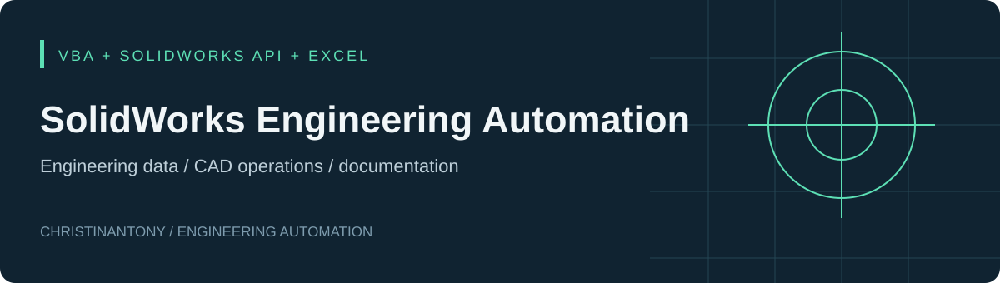
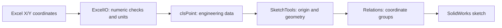

# SolidWorks Engineering Automation

VBA tools and experiments for repetitive mechanical CAD workflows: assembly numbering, Excel-driven sketch geometry, Hole Wizard feature creation, and annotation.

The portfolio collection contains **29 readable modules recovered from 16 SolidWorks macro containers**. The source makes the API workflows inspectable on GitHub. Each original macro remains a separate VBA project because module names and global variables overlap.

## Engineering problems addressed

| Workflow | Implemented approach | Inspect the source |
| :--- | :--- | :--- |
| Renumber assembly parts while updating references | Recursive component traversal, path-based de-duplication, preview, destination-conflict checks, document rename events, part/subassembly/top-level save sequence, matching drawing Save As | [Assembly renaming](src/assembly-renaming) |
| Transfer tabulated coordinates into CAD | Read X/Y from Excel, convert inches to meters, apply origin offsets, create sketch points, group equal coordinates, add horizontal/vertical relations | [Excel point importer](src/excel-point-importer) |
| Create hole features from selected points | Collect point/diameter/depth input, convert units, choose nearest drill code, call `HoleWizard5` | [Hole prototype](src/holes-from-sketch-points) |
| Explore drawing and annotation operations | Recorded drawing/front-view creation and interactive sketch-text/note numbering | [Experiments](experiments) |

**Status:** source reviewed; SolidWorks execution and compilation have not been verified in this portfolio build. Recorded macros and prototypes are labeled in the [complete inventory](docs/project-inventory.md).

## Architecture

The renaming workflow uses a different architecture: assembly traversal → candidate/name preview → conflict checks → rename API → reference-update event handlers → ordered saves → report. This captures a CAD dependency problem, beyond simple filename replacement.

## Use and review

1. Install SolidWorks on Windows. The point importer also requires desktop Excel. Recorded drawing paths originally referenced SolidWorks 2022; importer comments mention 2024. These are source clues, not a tested compatibility matrix.
2. Create a separate VBA macro project for the chosen folder in **Tools → Macro → New**.
3. Import its `.bas` standard modules and `.cls` class modules. Enable the installed **SolidWorks type library** and **SolidWorks constant type library** under VBA **Tools → References**.
4. Use **Debug → Compile**. Review API signatures, active-document assumptions, and the limitations below. Do not combine all project folders into one macro.
5. Test against disposable CAD copies and inspect output geometry/reference paths before adopting a workflow.

See the [usage guide](docs/usage.md), [coordinate example](examples/coordinates.csv), and [manual verification guide](docs/validation.md).

## Current limitations

- Several recorded macros assume particular faces, names, dimensions, and selections. The drawing prototype now uses example paths that must be configured locally.
- The point importer creates points and sketch relations. Its name does **not** establish finished hole creation or ordinate dimensioning; those modules include empty stubs.
- The hole prototype captures a face but does not explicitly reselect it in the creation loop. Cancellation, selection validity, and Hole Wizard parameters need testing.
- Annotation listeners contain unbounded loops. The selected-sketch label uses a curve evaluation point rather than a verified geometric center.
- The single-part rename experiment retains an existing-target deletion path. The featured assembly source has old-drawing deletion **disabled** in this published copy; all operations still need validation on CAD copies.

## Provenance

The supplied work is attributed to **Christinantony**. Recovery, organization, examples, and documentation were prepared for this portfolio. Binary originals remain in the owner's source archive; [SHA-256 hashes and module mappings](docs/inventory.json) record provenance. Published exports normalize whitespace, omit machine-specific recording comments, use example drawing paths, and export classes with `.cls` headers. The assembly default change is documented above. Algorithmic behavior is otherwise preserved.

No open-source license has been selected. See [rights notice](NOTICE.md).
