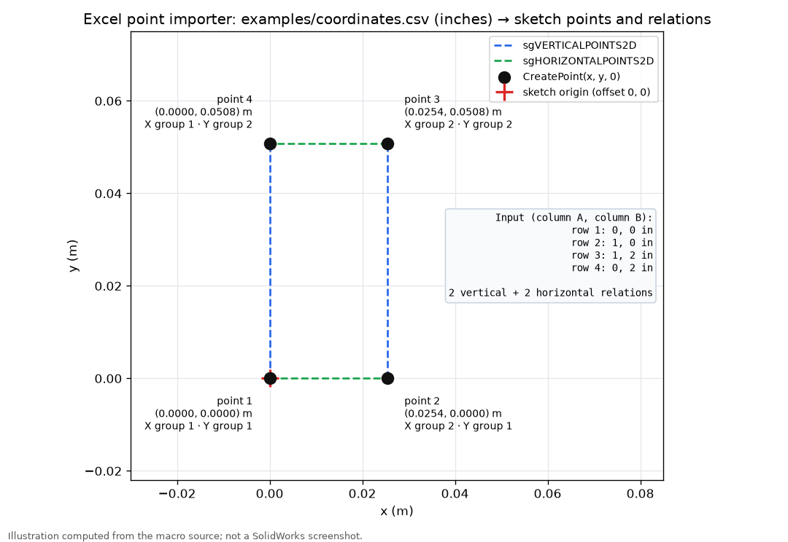

# Synthetic coordinate example

`coordinates.csv` is a four-point rectangle in inches, with no header. Open it in Excel and save as `.xlsx`. It is portfolio sample data, not recovered production geometry.

With zero origin, the expected points in meters are `(0,0)`, `(0.0254,0)`, `(0.0254,0.0508)`, and `(0,0.0508)`. This is a units-based expected result; no SolidWorks screenshot or runtime result is claimed.

*Computed from the importer's arithmetic in Python (`tools/make_figures.py`), not captured from SolidWorks.*
